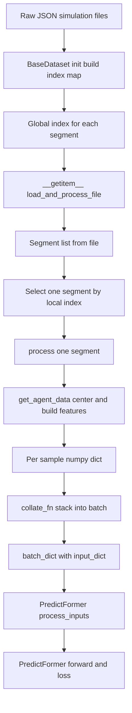

# Dataset Processing

# Predictformer

### 1. Overview

This module defines a dataset pipeline that:

1. Reads raw simulation logs from JSON files.
2. Slices each long simulation into overlapping (past + future) segments.
3. Converts each segment into **ego-centric, multi-agent feature tensors** and **ground-truth future trajectories**.
4. Packs everything into the exact `input_dict` format expected by `PredictFormer`.

The high-level flow is:


---

### 2. Raw data format (JSON)

Each JSON file is a list of timesteps. At each timestep:

```json
{
"time_step":0.0,
"ego":[ ... features ...],
"controls":[ ...],
"vehicles":[
[ ... pursuer0 features ...],
[ ... pursuer1 features ...]
]
}

```

Roughly:

- `ego` is a 1D array of ego state features (e.g. x, y, z, heading, speed, etc.).
- `controls` is a 1D array of control inputs (e.g. bank, pitch, throttle, etc.).
- `vehicles` is a list of other agents, each with the same feature structure as ego.

Over time this gives:

```
T timesteps
  ego:       (T, ego_features)
  controls:  (T, control_features)
  vehicles:  (num_pursuers, T, vehicle_features)

```

These are stacked into a single array:

```python
overall_traj.shape == (num_agents, T, features)
# num_agents = 1 ego + num_pursuers

```

---

### 3. BaseDataset: lazy indexing over segments

### 3.1 Initialization

```python
classLazyBaseDataset(Dataset):
def__init__(self, config, is_test=False, is_validation=False, num_samples=None):
        ...
self.past_len   = config['past_len']
self.future_len = config['future_len']
self.step_size  = config.get('step_size',1)
self.index_map  = []

```

- Chooses `train_data_path` / `val_data_path` / `test_data_path` based on flags.
- Collects all `.json` files.
- Reads each file **once** to find `total_steps = len(sim_data)`.

For each file:

```python
total_len = past_len + future_len
num_segments = compute_num_segments(total_steps, total_len, step_size)
for local_seg_idxinrange(num_segments):
self.index_map.append((file_idx, local_seg_idx))

```

So:

- `self.index_map[i] = (file_idx, local_seg_idx)`
    
    tells you which file and which local window that global sample index refers to.
    
- `__len__()` returns the total number of segments across all files.

This is what makes the dataset **lazy**: it doesn’t materialize all segments up front, just builds an index.

---

### 4. **getitem**: from global index → one raw segment

```python
def__getitem__(self, global_index):
    file_idx, local_seg_idx =self.index_map[global_index]
    file_path =self.json_files[file_idx]
    segments =self.load_and_process_file(file_path)
return segments[local_seg_idx]

```

Steps:

1. Map `global_index` to `(file_idx, local_seg_idx)`.
2. Call `load_and_process_file(file_path)` to:
    - read the JSON,
    - build full arrays,
    - slice the simulation into all segments for that file.
3. Return only `segments[local_seg_idx]`.

At this point, each returned item is a **“raw segment dict”**:

```python
{
'segment_data': np.ndarray(num_agents, total_len, features),
'timestamp':list[total_len],
'idx_to_track': ego_index (usually0),
'segment_idx':int,
'object_type':list[num_agents],
'tracks_to_predict': {
'track_index': [0,1, ..., num_agents-1],
'object_type': [...]
    }
}

```

This is still in **world coordinates**, with past and future concatenated along the time axis.

---

### 5. load_and_process_file: build arrays and segment in time

Inside `load_and_process_file`:

1. Read the JSON list: `sim_data`.
2. Build:
    
    ```python
    overall_ego_position# (T, ego_features)
    overall_controls# (T, control_features)
    overall_pursuer_positions# (num_pursuers, T, features)
    overall_traj# (num_agents, T, features)  stacked ego + pursuers
    overall_timestamps# list[T]
    
    ```
    
3. Compute:
    
    ```python
    total_len = past_len + future_len
    
    ```
    
4. Iterate in a sliding-window over time:
    
    ```python
    for start_idxinrange(total_len,len(sim_data) - total_len +1, step_size):
        segment = overall_traj[:, start_idx - total_len:start_idx, :]
        segment_ts = overall_timestamps[start_idx : start_idx + total_len]
        processed_segment =self.process_segment(segment, segment_ts, idx_counter)
        segments.append(processed_segment)
    
    ```
    

Each `segment` is shape `(num_agents, total_len, features)`.

- `process_segment` just adds metadata (ego index, object types, tracks_to_predict, timestamps).

---

### 6. process_segment: simple wrapping for one segment

`process_segment` takes:

```python
segment:   (num_agents, total_len, features)
timestamps:list[total_len]
idx:       segment index within this file

```

It constructs:

```python
processed = {
    'object_type': [VEHICLE, VEHICLE, ...],
    'timestamp': timestamps,
    'idx_to_track': ego_idx,
    'segment_idx': idx,
    'segment_data': segment,
    'tracks_to_predict': {
    'track_index': [0,1, ..., num_agents-1],
    'object_type': [VEHICLE, ...],
        },
}

```

This is the object returned by `__getitem__`.

---

### 7. process(): from raw segment → centered, feature-rich scene

In `collate_fn`, you call `self.process(sample)` for each raw segment.

`process(sim_data)`:

1. Pulls out:
    
    ```python
    idx_to_track    = sim_data['idx_to_track']
    timestamp       = sim_data['timestamp']
    obj_trajs_full  = sim_data['segment_data']# (num_agents, total_len, features)
    obj_types       = sim_data['object_type']
    
    ```
    
2. Converts heading degrees → radians.
3. Splits into **past** and **future**:
    
    ```python
    obj_trajs_past   = obj_trajs_full[:, :past_len, :]
    obj_trajs_future = obj_trajs_full[:, past_len:, :]
    ```
    
4. (Optionally) injects measurement noise into `obj_trajs_past`.
5. Calls `get_agent_data(...)`, which performs:
    - **Ego-centric transform** (center and heading subtraction)
    - **Feature construction** (one-hot type, time embedding, heading sin/cos, velocity, acceleration)
    - **Future GT centering** (same transform for future)
    - **Masking and pruning** (keep closest `max_num_agents`)
    - **Padding** to fixed `max_num_agents`

`get_agent_data` returns:
```python
(
  obj_trajs_data,# past features [num_centers, num_objects, T_past, k_attr]
  obj_trajs_mask,# past masks   [num_centers, num_objects, T_past]
  obj_trajs_pos,# positions    [num_centers, num_objects, T_past, 3]
  obj_trajs_last_pos,# last pos per object
  obj_trajs_future_state,# future state [num_centers, num_objects, T_future, 5]
  obj_trajs_future_mask,# future mask
  center_gt_trajs,# future GT for center agent [num_centers, T_future, 5]
  center_gt_trajs_mask,
  center_gt_final_valid_idx,
  track_index_to_predict_new
)

```

`process()` then packs this into a single numpy dict `ret`, which will later be stacked into a batch.

---

### 8. collate_fn: build batch_dict and input_dict for PredictFormer

`collate_fn` takes a list of raw samples from `__getitem__`, runs `process` on each:

```python
processed_data = [self.process(sample)for samplein data_list]

```

Then stacks each key:

```python
input_dict[key] = torch.from_numpy(
    np.stack([sample[key]for samplein processed_data])
)

```

So for example:

```python
input_dict['obj_trajs'].shape# [B, num_objects, T_past, k_attr]
input_dict['obj_trajs_mask'].shape# [B, num_objects, T_past]
input_dict['center_gt_trajs'].shape# [B, T_future, 5]
...

```

Finally, it returns:

```python
batch_dict = {
'batch_size': batch_size,
'input_dict': input_dict,
'batch_sample_count': batch_size
}

```

This `batch_dict` is exactly what you pass to:

```python
output, loss = model(batch_dict)

```

---

### 9. PredictFormer interface

Inside `PredictFormer.forward(batch)`:

1. The model grabs `batch['input_dict']`.
2. In `process_inputs`, it uses:
    
    ```python
    agents_in  = input_dict['obj_trajs']# [B, T, M, k_attr] after reshape/transpose
    agents_mask= input_dict['obj_trajs_mask']# [B, T, M]
    track_index_to_predict# index of the ego/center agent
    
    ```
    
3. It builds `ego_in` (center agent trajectory) and `agents_in` + masks in the exact format `_forward()` expects:
    - `ego_in`: `[B, T_obs, k_attr+1]`
    - `agents_in`:`[B, T_obs, M-1, k_attr+1]` (plus existence mask channel)
4. `_forward()` then:
    - encodes with `PerceiverEncoder`
    - decodes with `PerceiverDecoder`
    - outputs:
        
        ```python
        predicted_trajectory# [B, num_modes, T_future, 7]
        predicted_probability# [B, num_modes]
        scene_emb# [B, num_queries_dec * d_k]
        
        ```
        
5. `Criterion` uses these plus `center_gt_trajs` and `center_gt_final_valid_idx` to compute the GMM NLL + mode classification loss.
