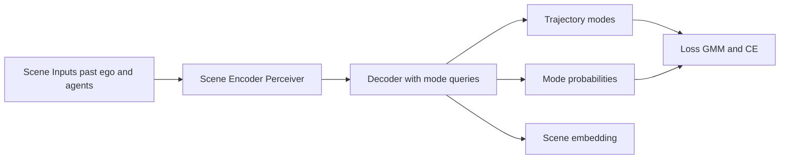
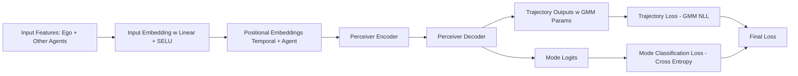
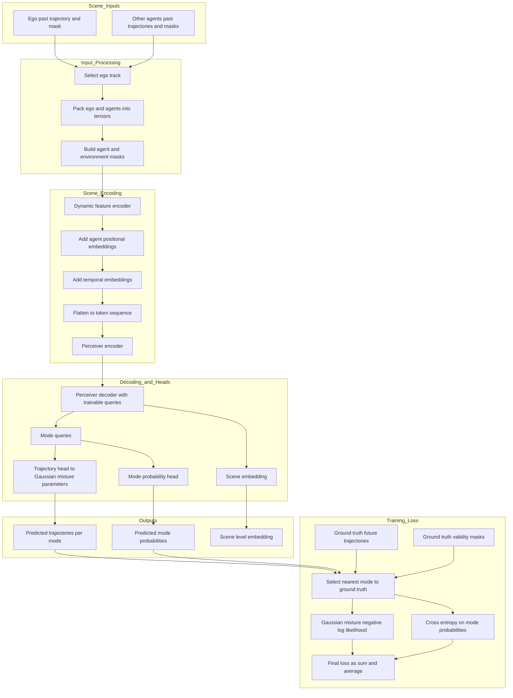
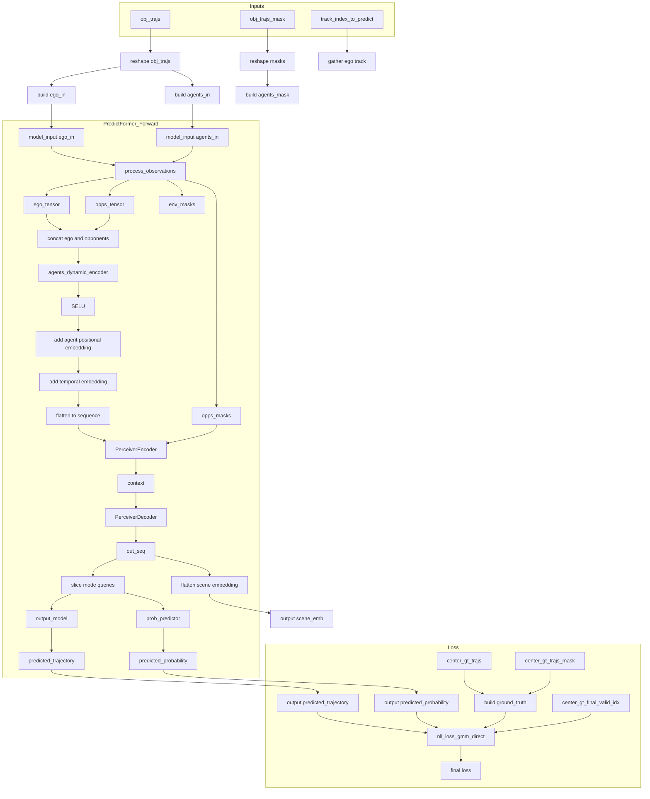

```mermaid
flowchart LR
Inputs[Scene Inputs past ego and agents] --> Enc[Scene Encoder Perceiver]
Enc --> Dec[Decoder with mode queries]
Dec --> Traj[Trajectory modes]
Dec --> Prob[Mode probabilities]
Dec --> Emb[Scene embedding]
Traj --> Loss[Loss GMM and CE]
Prob --> Loss  
```

```mermaid
flowchart LR
A[Input Features: Ego + Other Agents] --> B[Input Embedding w Linear + SELU]
B --> C[Positional Embeddings Temporal + Agent]
C --> D[Perceiver Encoder]
D --> E[Perceiver Decoder]
E --> F[Trajectory Outputs w GMM Params]
E --> G[Mode Logits]
F --> H[Trajectory Loss - GMM NLL]
G --> I[Mode Classification Loss - Cross Entropy]
H --> J[Final Loss]
I --> J

```

```mermaid
flowchart TD

  subgraph Scene_Inputs
    IN1[Ego past trajectory and mask]
    IN2[Other agents past trajectories and masks]
  end

  subgraph Input_Processing
    P1[Select ego track]
    P2[Pack ego and agents into tensors]
    P3[Build agent and environment masks]
  end

  subgraph Scene_Encoding
    E1[Dynamic feature encoder]
    E2[Add agent positional embeddings]
    E3[Add temporal embeddings]
    E4[Flatten to token sequence]
    E5[Perceiver encoder]
  end

  subgraph Decoding_and_Heads
    D1[Perceiver decoder with trainable queries]
    D2[Mode queries]
    H1[Trajectory head to Gaussian mixture parameters]
    H2[Mode probability head]
    H3[Scene embedding]
  end

  subgraph Outputs
    O1[Predicted trajectories per mode]
    O2[Predicted mode probabilities]
    O3[Scene level embedding]
  end

  subgraph Training_Loss
    GT1[Ground truth future trajectories]
    GT2[Ground truth validity masks]
    L1[Select nearest mode to ground truth]
    L2[Gaussian mixture negative log likelihood]
    L3[Cross entropy on mode probabilities]
    L4[Final loss as sum and average]
  end

  IN1 --> P1
  IN2 --> P1

  P1 --> P2
  P2 --> P3

  P3 --> E1
  E1 --> E2
  E2 --> E3
  E3 --> E4
  E4 --> E5

  E5 --> D1
  D1 --> D2
  D2 --> H1
  D2 --> H2
  D1 --> H3

  H1 --> O1
  H2 --> O2
  H3 --> O3

  O1 --> L1
  O2 --> L1
  GT1 --> L1
  GT2 --> L1

  L1 --> L2
  L1 --> L3
  L2 --> L4
  L3 --> L4

```

## Gritty Details

```mermaid
flowchart TD

  %% ---------- INPUT PROCESSING ----------
  subgraph Inputs
    A0[obj_trajs]
    A1[obj_trajs_mask]
    A2[track_index_to_predict]
  end

  A0 --> B0[reshape obj_trajs]
  A1 --> B1[reshape masks]
  A2 --> B2[gather ego track]

  B0 --> C0[build ego_in]
  B0 --> C2[build agents_in]
  B1 --> C1[build agents_mask]

  C0 --> D0[model_input ego_in]
  C2 --> D1[model_input agents_in]

  %% ---------- CORE MODEL ----------
  subgraph PredictFormer_Forward
    direction LR

    D0 --> E0[process_observations]
    D1 --> E0

    E0 --> E1[ego_tensor]
    E0 --> E2[opps_tensor]
    E0 --> E3[opps_masks]
    E0 --> E4[env_masks]

    E1 --> F0[concat ego and opponents]
    E2 --> F0

    F0 --> F1[agents_dynamic_encoder]
    F1 --> F2[SELU]
    F2 --> F3[add agent positional embedding]
    F3 --> F4[add temporal embedding]
    F4 --> F5[flatten to sequence]

    F5 --> G0[PerceiverEncoder]
    E3 --> G0
    G0 --> G1[context]

    G1 --> H0[PerceiverDecoder]
    H0 --> H1[out_seq]

    H1 --> I0[slice mode queries]
    I0 --> J0[output_model]
    J0 --> J1[predicted_trajectory]

    I0 --> K0[prob_predictor]
    K0 --> K1[predicted_probability]

    H1 --> L0[flatten scene embedding]
  end

  J1 --> O0[output predicted_trajectory]
  K1 --> O1[output predicted_probability]
  L0 --> O2[output scene_emb]

  %% ---------- LOSS / CRITERION ----------
  subgraph Loss
    P0[center_gt_trajs]
    P1[center_gt_trajs_mask]
    P2[center_gt_final_valid_idx]

    P0 --> Q0[build ground_truth]
    P1 --> Q0

    O0 --> R0[nll_loss_gmm_direct]
    O1 --> R0
    Q0 --> R0
    P2 --> R0

    R0 --> R1[final loss]
  end
```